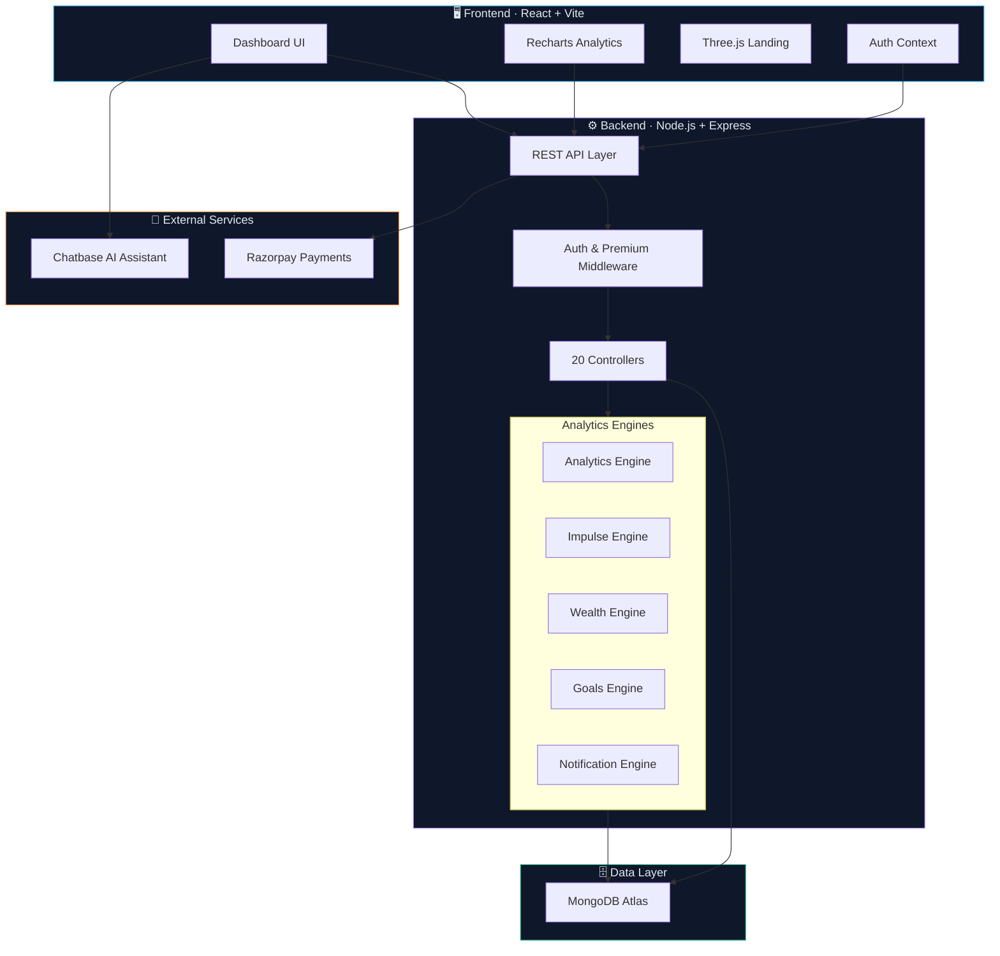
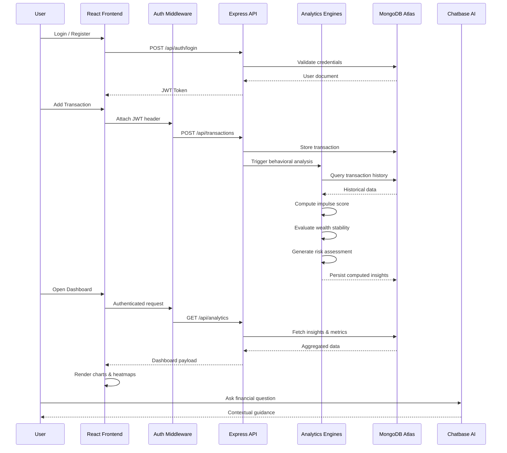
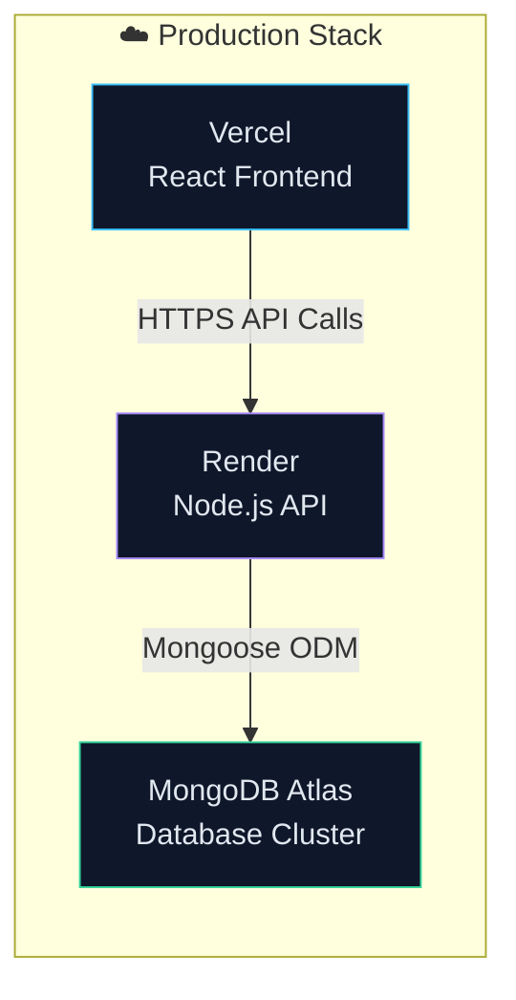

# Strocter 💠

> **Behavioral Finance Intelligence Platform** — Decode your money psychology and master your spending patterns.

[](https://nodejs.org/)
[](https://react.dev/)
[](https://www.mongodb.com/atlas)
[](LICENSE)
[]()

Strocter is an enterprise-grade **behavioral finance platform** that fuses spending analytics with cognitive psychology to reveal **why** you spend — not just **what** you spend. It leverages purpose-built engines for **Impulse Detection**, **Wealth Stability Analysis**, **Risk Scoring**, and **Behavioral Pattern Recognition** to deliver actionable financial intelligence.

---

## 🏛️ System Architecture

Strocter operates on a decoupled **client-server architecture** with dedicated analytics engines processing behavioral data in real time.



| Layer | Technology | Purpose |
|-------|-----------|---------|
| **Frontend** | React 19, Vite 7, Tailwind CSS 4 | Interactive fintech dashboard with glassmorphism UI |
| **3D & Motion** | Three.js, React Three Fiber, GSAP, Framer Motion | Immersive landing page & micro-animations |
| **Backend** | Node.js, Express 5 | RESTful API with layered controller architecture |
| **Database** | MongoDB Atlas, Mongoose ODM | Document store for transactions & behavioral data |
| **Payments** | Razorpay SDK | Subscription management & premium tier |
| **AI Assistant** | Chatbase | Context-aware financial guidance chatbot |
| **Visualization** | Recharts | Dynamic charts for behavioral analytics |

---

## 🔄 Execution Flow

The internal data lifecycle demonstrates how Strocter processes, analyzes, and surfaces behavioral financial insights.



---

## ✨ Key Features

### 🧠 Behavioral Spending Analysis
Identifies patterns in impulsive purchases, emotional spending triggers, and cognitive biases. The **Impulse Engine** tracks spending velocity, regret-tagged transactions, and trigger categories to build a comprehensive behavioral profile.

### 📊 Financial Intelligence Dashboard
A premium fintech dashboard with real-time analytics, spending heatmaps, sentiment charts, cognitive load panels, and category breakdowns — all rendered with interactive Recharts visualizations.

### 💰 Wealth Stability Engine
Monitors financial health through asset allocation tracking, risk radar analysis, stability trend forecasting, and strategic growth outlooks. Delivers a composite stability score for long-term wealth management.

### 🎯 Goal Tracking System
Set, monitor, and achieve financial goals with intelligent progress tracking. The **Goals Engine** provides milestone analysis, completion predictions, and motivational insights.

### 🤖 AI Financial Assistant
An integrated Chatbase-powered chatbot embedded across all authenticated pages. Provides contextual financial guidance, spending recommendations, and behavioral coaching in real time.

### 💳 Subscription & Premium Tier
Razorpay-powered subscription system supporting free and premium tiers. Premium features are gated through dedicated middleware ensuring secure paywall enforcement.

### 🛡️ Secure Authentication
JWT-based authentication layer with protected API routes. Features include route-level access control via `authMiddleware`, premium-only feature gating via `premiumOnly` middleware, and configurable feature access policies.

### 🎨 Modern Fintech UI/UX
Glassmorphism design system with dark theme, 3D perspective cards, an animated Three.js landing hero, smooth GSAP scroll animations, and Framer Motion transitions — optimized for financial data density.

### 📁 Data Archival & Export
Full transaction archival system with CSV/PDF export capabilities via `json2csv` and `PDFKit`. Enables data portability and compliance-ready record keeping.

### 📈 Risk Scoring Engine
Quantifies financial risk exposure through multi-factor behavioral analysis. Assigns dynamic risk scores based on spending volatility, impulse frequency, and wealth stability metrics.

---

## 🚀 Quick Start (Local Development)

### Prerequisites

- **Node.js** ≥ 18.x
- **npm** ≥ 9.x
- **MongoDB** (local instance or [MongoDB Atlas](https://www.mongodb.com/atlas) cluster)

### 1. Clone the Repository

```bash
git clone https://github.com/your-username/strocter.git
cd strocter
```

### 2. Start the Backend

```bash
cd backend
npm install
```

Create a `.env` file in the `backend/` directory (see [Environment Variables](#-environment-variables)):

```bash
npm run dev
```

The API server will start at **`http://localhost:5000`**.

### 3. Start the Frontend

```bash
cd frontend
npm install
```

Create a `.env` file in the `frontend/` directory:

```bash
npm run dev
```

The app will launch at **`http://localhost:5173`**.

---

## 🔐 Environment Variables

### Backend (`backend/.env`)

| Variable | Description | Example |
|----------|-------------|---------|
| `PORT` | Server port | `5000` |
| `MONGO_URI` | MongoDB connection string | `mongodb+srv://...` |
| `NODE_ENV` | Runtime environment | `development` |
| `JWT_SECRET` | Secret for signing JWT tokens | `your_jwt_secret_key` |
| `RAZORPAY_KEY_ID` | Razorpay API key | `rzp_test_...` |
| `RAZORPAY_KEY_SECRET` | Razorpay secret | `your_razorpay_secret` |

### Frontend (`frontend/.env`)

| Variable | Description | Example |
|----------|-------------|---------|
| `VITE_API_URL` | Backend API base URL | `http://localhost:5000` |
| `VITE_RAZORPAY_KEY_ID` | Razorpay publishable key | `rzp_test_...` |

---

## 🌐 Deployment

Strocter uses a fully decoupled deployment strategy, enabling independent scaling of each tier.



| Service | Platform | Details |
|---------|----------|---------|
| **Frontend** | [Vercel](https://vercel.com) | Automatic deployments from `main` branch, edge CDN |
| **Backend** | [Render](https://render.com) | Auto-deploy with health check at `/health` |
| **Database** | [MongoDB Atlas](https://mongodb.com/atlas) | M0 free tier or dedicated cluster with auto-scaling |

> **Note:** The architecture supports **horizontal scaling** — the stateless Express API can be replicated behind a load balancer, and MongoDB Atlas supports read replicas for query distribution.

---

## 📂 Project Structure

```
strocter/
│
├── backend/                        # Node.js + Express API
│   ├── config/
│   │   ├── db.js                   # MongoDB connection setup
│   │   └── razorpay.js             # Razorpay SDK initialization
│   ├── controllers/                # Request handlers (20 controllers)
│   │   ├── authController.js       # Registration & login logic
│   │   ├── transactionController.js# CRUD + behavioral tagging
│   │   ├── behavioralController.js # Behavioral pattern aggregation
│   │   ├── impulseController.js    # Impulse detection & scoring
│   │   ├── wealthController.js     # Wealth stability metrics
│   │   ├── riskScoreController.js  # Risk factor computation
│   │   ├── goalsController.js      # Goal tracking operations
│   │   ├── dashboardController.js  # Dashboard data aggregation
│   │   ├── insightController.js    # Insight generation
│   │   ├── paymentController.js    # Razorpay order & verification
│   │   ├── subscriptionController.js # Premium tier management
│   │   ├── archiveController.js    # CSV/PDF data export
│   │   └── ...                     # + 8 more controllers
│   ├── middleware/
│   │   ├── authMiddleware.js       # JWT verification guard
│   │   ├── errorHandler.js         # Global error handler
│   │   ├── featureAccess.js        # Feature-level access control
│   │   └── premiumOnly.js          # Premium tier paywall gate
│   ├── models/                     # Mongoose schemas (6 models)
│   │   ├── User.js                 # User profile + auth data
│   │   ├── Transaction.js          # Financial transactions
│   │   ├── Goal.js                 # Financial goals
│   │   ├── Payment.js              # Payment records
│   │   ├── Subscription.js         # Premium subscriptions
│   │   └── SystemSettings.js       # Application configuration
│   ├── routes/                     # Express route modules (14 routes)
│   ├── services/                   # Business logic engines
│   │   ├── analyticsEngine.js      # Core analytics computation
│   │   ├── impulseEngine.js        # Impulse behavior analysis
│   │   ├── wealthEngine.js         # Wealth stability calculations
│   │   ├── goalsEngine.js          # Goal progress engine
│   │   ├── notificationEngine.js   # Alert & notification logic
│   │   ├── reportGenerator.js      # PDF/CSV report generation
│   │   ├── subscriptionEngine.js   # Subscription lifecycle
│   │   └── settingsEngine.js       # Dynamic settings management
│   ├── utils/
│   │   └── exportCSV.js            # CSV serialization utility
│   └── server.js                   # Express app entry point
│
├── frontend/                       # React + Vite SPA
│   ├── src/
│   │   ├── components/
│   │   │   ├── Landing/            # Landing page sections
│   │   │   │   ├── HeroScene.jsx   # Three.js 3D hero
│   │   │   │   ├── BackgroundS.jsx # Animated "S" particle system
│   │   │   │   ├── Feature3DCard.jsx # 3D perspective cards
│   │   │   │   ├── IntelligenceSection.jsx
│   │   │   │   ├── SecuritySection.jsx
│   │   │   │   └── ...             # + 6 more sections
│   │   │   ├── behavior/           # Behavioral analytics panels
│   │   │   │   ├── HeatmapPanel.jsx
│   │   │   │   ├── SentimentChart.jsx
│   │   │   │   ├── CognitivePanel.jsx
│   │   │   │   └── CategoryBreakdown.jsx
│   │   │   ├── Wealth/             # Wealth stability widgets
│   │   │   │   ├── RiskRadarChart.jsx
│   │   │   │   ├── StabilityTrendChart.jsx
│   │   │   │   ├── AssetAllocationPanel.jsx
│   │   │   │   └── StrategicGrowthOutlook.jsx
│   │   │   ├── Impulse/            # Impulse tracking components
│   │   │   ├── Goals/              # Goal management components
│   │   │   ├── Archive/            # Data export interface
│   │   │   ├── Pricing/            # Subscription plans
│   │   │   ├── Settings/           # User preferences
│   │   │   ├── Sidebar.jsx         # Navigation sidebar
│   │   │   ├── TopNav.jsx          # Header navigation
│   │   │   └── ChatbotWidget.jsx   # AI assistant widget
│   │   ├── pages/                  # Route-level page components
│   │   │   ├── Landing.jsx
│   │   │   ├── Login.jsx
│   │   │   ├── dashboard/
│   │   │   ├── transactions/
│   │   │   ├── behavioral/
│   │   │   ├── wealth/
│   │   │   ├── impulse/
│   │   │   ├── goals/
│   │   │   ├── archive/
│   │   │   ├── settings/
│   │   │   └── pricing/
│   │   ├── services/               # API client layer (11 services)
│   │   ├── context/                # React context providers
│   │   │   └── AuthContext.jsx     # Authentication state
│   │   ├── routes/
│   │   │   └── ProtectedRoute.jsx  # Route guard HOC
│   │   └── App.jsx                 # Root router configuration
│   ├── index.html
│   ├── vite.config.js
│   └── vercel.json                 # Vercel deployment config
│
└── README.md
```

---

## 🔒 Security Considerations

| Layer | Mechanism | Details |
|-------|-----------|---------|
| **Authentication** | JWT Tokens | Stateless auth with signed JSON Web Tokens |
| **Route Protection** | Auth Middleware | All `/api/*` routes (except auth) require valid JWT |
| **Premium Gating** | Premium Middleware | Feature-level access control for paid subscribers |
| **Password Security** | bcrypt.js | Salted & hashed password storage |
| **Payment Security** | Razorpay SDK | Server-side payment verification with signature validation |
| **CORS Policy** | Origin Whitelist | Strict origin validation for allowed domains |
| **Environment Secrets** | dotenv | All secrets loaded from environment — never committed |
| **Error Handling** | Global Handler | Centralized error handler prevents stack trace leakage |

---

## 🗺️ Future Roadmap

- [ ] **AI-Driven Spending Predictions** — ML-powered forecasting engine for proactive financial planning
- [ ] **Mobile Application** — React Native companion app for on-the-go tracking
- [ ] **Multi-Account Aggregation** — Connect and unify data from multiple bank accounts
- [ ] **Advanced Behavioral Scoring** — Composite psychology score with temporal decay modeling
- [ ] **Financial Habit Coaching** — Personalized coaching engine with streak tracking and nudge systems
- [ ] **Social Benchmarking** — Anonymous peer comparison for spending behavior analysis
- [ ] **Budget Automation** — Rule-based automatic budget allocation using behavioral signals
- [ ] **Webhook Integrations** — Real-time alerts via Slack, Discord, and email

---

## 📄 License

This project is licensed under the **MIT License** — see the [LICENSE](LICENSE) file for details.

```
MIT License

Copyright (c) 2025 Harsh K. Singh

Permission is hereby granted, free of charge, to any person obtaining a copy
of this software and associated documentation files (the "Software"), to deal
in the Software without restriction, including without limitation the rights
to use, copy, modify, merge, publish, distribute, sublicense, and/or sell
copies of the Software, and to permit persons to whom the Software is
furnished to do so, subject to the following conditions:

The above copyright notice and this permission notice shall be included in all
copies or substantial portions of the Software.

THE SOFTWARE IS PROVIDED "AS IS", WITHOUT WARRANTY OF ANY KIND, EXPRESS OR
IMPLIED, INCLUDING BUT NOT LIMITED TO THE WARRANTIES OF MERCHANTABILITY,
FITNESS FOR A PARTICULAR PURPOSE AND NONINFRINGEMENT. IN NO EVENT SHALL THE
AUTHORS OR COPYRIGHT HOLDERS BE LIABLE FOR ANY CLAIM, DAMAGES OR OTHER
LIABILITY, WHETHER IN AN ACTION OF CONTRACT, TORT OR OTHERWISE, ARISING FROM,
OUT OF OR IN CONNECTION WITH THE SOFTWARE OR THE USE OR OTHER DEALINGS IN THE
SOFTWARE.
```

---

<div align="center">

### Built with 🧠 by [Harsh K. Singh](https://github.com/your-username)

**Strocter** — *Because understanding your money starts with understanding your mind.*

</div>
