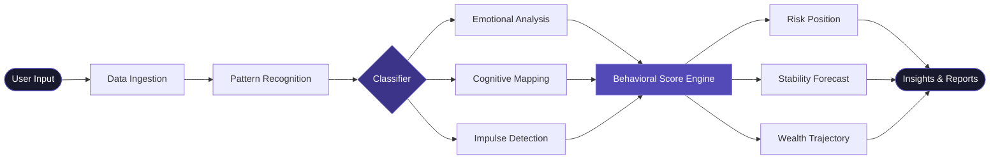
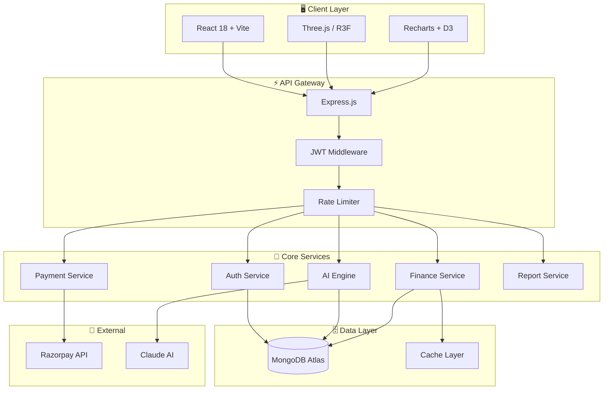
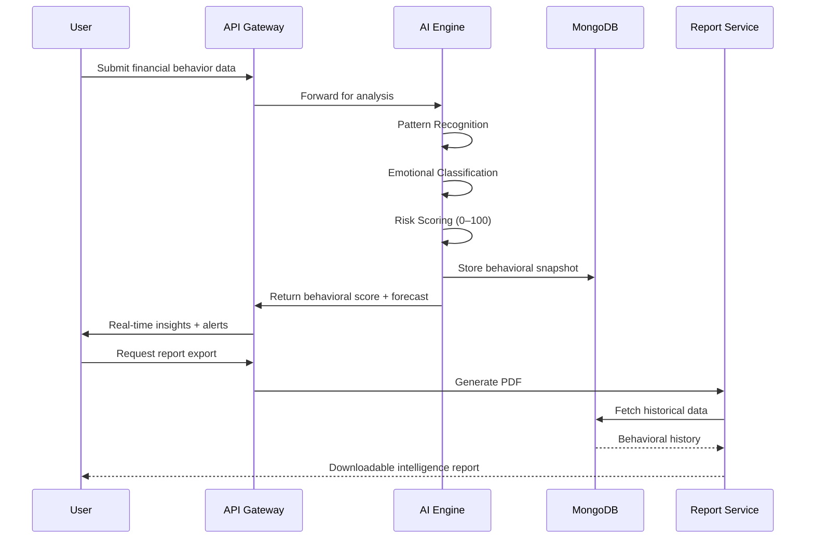
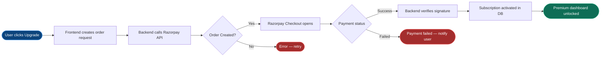
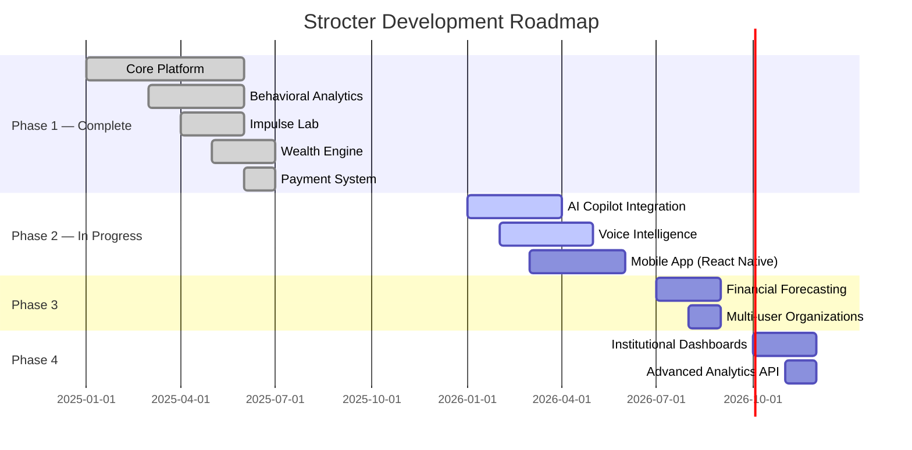

<p align="center">
  
</p>

<h1 align="center">Strocter</h1>

<p align="center">
  <strong>Behavioral Finance Intelligence Platform</strong><br/>
  Decode impulse. Engineer stability. Predict behavioral risk.
</p>

<p align="center">
  
  
  
  
  
</p>

---

## Overview

**Strocter** is an enterprise-grade behavioral finance platform that decodes the psychology behind spending decisions using AI-powered cognitive analysis, real-time behavioral scoring, and immersive 3D data visualization.

It bridges the gap between **emotional finance** and **mathematical stability** — giving individuals and institutions the tools to understand, predict, and engineer better financial outcomes.

---

## 🧠 Platform Workflow


```mermaid
flowchart LR
    A([User Input]) --> B[Data Ingestion]
    B --> C[Pattern Recognition]
    C --> D{Classifier}
    D --> E[Emotional Analysis]
    D --> F[Cognitive Mapping]
    D --> G[Impulse Detection]
    E --> H[Behavioral Score Engine]
    F --> H
    G --> H
    H --> I[Risk Position]
    H --> J[Stability Forecast]
    H --> K[Wealth Trajectory]
    I --> L([Insights & Reports])
    J --> L
    K --> L

    style A fill:#1a1a2e,stroke:#534AB7,color:#fff
    style L fill:#1a1a2e,stroke:#534AB7,color:#fff
    style H fill:#534AB7,stroke:#7F77DD,color:#fff
    style D fill:#3C3489,stroke:#7F77DD,color:#fff
```

---

## ⚡ Core Modules

| Module | Description |
|--------|-------------|
| **Behavioral Analytics** | Deep analysis of emotional spending patterns, dopamine-driven decisions, and cognitive financial behaviors |
| **Impulse AI Lab** | Real-time impulse trigger simulation, stress correlation mapping, and behavioral forecasting |
| **Wealth Stability Engine** | Risk positioning, 12-month trajectory modeling, and asset allocation intelligence |
| **Intelligence Archive** | Exportable PDF reports, historical AI snapshots, and behavioral trend history |
| **AI Goal Planning** | Behavioral target systems, habit correction loops, and AI strategy memos |
| **Institutional Settings** | Risk governance controls, sensitivity calibration, and enterprise security layers |

---

## 🏗️ System Architecture


```mermaid
flowchart TD
    subgraph Client["🖥️ Client Layer"]
        UI[React 18 + Vite]
        Three[Three.js / R3F]
        Charts[Recharts + D3]
    end

    subgraph Gateway["⚡ API Gateway"]
        Express[Express.js]
        Auth[JWT Middleware]
        Rate[Rate Limiter]
    end

    subgraph Services["🧠 Core Services"]
        AuthSvc[Auth Service]
        AISvc[AI Engine]
        FinSvc[Finance Service]
        PaySvc[Payment Service]
        RepSvc[Report Service]
    end

    subgraph Data["🗄️ Data Layer"]
        Mongo[(MongoDB Atlas)]
        Cache[Cache Layer]
    end

    subgraph External["🔗 External"]
        Razorpay[Razorpay API]
        Claude[Claude AI]
    end

    UI --> Express
    Three --> Express
    Charts --> Express
    Express --> Auth --> Rate
    Rate --> AuthSvc & AISvc & FinSvc & PaySvc & RepSvc
    AuthSvc & AISvc & FinSvc --> Mongo
    FinSvc --> Cache
    PaySvc --> Razorpay
    AISvc --> Claude
```

---

## 🤖 AI Behavioral Pipeline


```mermaid
sequenceDiagram
    participant U as User
    participant API as API Gateway
    participant AI as AI Engine
    participant DB as MongoDB
    participant R as Report Service

    U->>API: Submit financial behavior data
    API->>AI: Forward for analysis
    AI->>AI: Pattern Recognition
    AI->>AI: Emotional Classification
    AI->>AI: Risk Scoring (0–100)
    AI->>DB: Store behavioral snapshot
    AI->>API: Return behavioral score + forecast
    API->>U: Real-time insights + alerts
    U->>API: Request report export
    API->>R: Generate PDF
    R->>DB: Fetch historical data
    DB-->>R: Behavioral history
    R-->>U: Downloadable intelligence report
```

---

## 💳 Payment Flow


```mermaid
flowchart LR
    A([User clicks Upgrade]) --> B[Frontend creates order request]
    B --> C[Backend calls Razorpay API]
    C --> D{Order Created?}
    D -- Yes --> E[Razorpay Checkout opens]
    D -- No --> F([Error — retry])
    E --> G{Payment status}
    G -- Success --> H[Backend verifies signature]
    H --> I[Subscription activated in DB]
    I --> J([Premium dashboard unlocked])
    G -- Failed --> K([Payment failed — notify user])

    style A fill:#0C447C,stroke:#378ADD,color:#fff
    style J fill:#0F6E56,stroke:#1D9E75,color:#fff
    style F fill:#A32D2D,stroke:#E24B4A,color:#fff
    style K fill:#A32D2D,stroke:#E24B4A,color:#fff
```

---

## 🛠️ Tech Stack

| Layer | Technology |
|-------|-----------|
| Frontend | React 18 · Vite · TypeScript · Tailwind CSS |
| 3D & Motion | Three.js · React Three Fiber · GSAP · Framer Motion |
| Backend | Node.js · Express.js |
| Database | MongoDB · Mongoose |
| Auth | JWT · bcrypt |
| Payments | Razorpay |
| Deployment | Vercel (frontend) · Render (backend) |

---

## 📂 Project Structure

```text
strocter/
├── frontend/
│   └── src/
│       ├── components/        # UI, charts, Three.js components
│       ├── pages/             # Landing, Dashboard, ImpulseLab, WealthEngine
│       ├── hooks/             # useAuth, useAI, useAnalytics
│       ├── animations/        # GSAP scroll sequences
│       └── shaders/           # WebGL custom shaders
│
├── backend/
│   ├── controllers/           # auth, finance, ai, payment
│   ├── middleware/            # JWT auth, subscription, validation
│   ├── models/                # User, Transaction, BehavioralData
│   ├── routes/                # API route definitions
│   └── utils/                 # aiEngine, behavioralScoring, helpers
│
└── public/                    # Static assets & 3D models
```

---

## 🚀 Getting Started

### Prerequisites

- Node.js v18+
- MongoDB Atlas account
- Razorpay account

### Installation

```bash
git clone https://github.com/harshksingh/strocter.git
cd strocter
```

**Frontend**
```bash
cd frontend && npm install && npm run dev
# Runs at http://localhost:5173
```

**Backend**
```bash
cd backend && npm install && npm run dev
# Runs at http://localhost:5000
```

### Environment Variables

**Backend** (`backend/.env`)
```env
PORT=5000
MONGO_URI=your_mongodb_connection_string
JWT_SECRET=your_jwt_secret_min_32_chars
RAZORPAY_KEY_ID=rzp_live_your_key_id
RAZORPAY_KEY_SECRET=rzp_live_your_key_secret
```

**Frontend** (`frontend/.env`)
```env
VITE_API_URL=http://localhost:5000/api
VITE_RAZORPAY_KEY=rzp_live_your_key_id
```

---

## 🛡️ Security

- JWT authentication with 7-day expiry
- bcrypt password hashing (12 rounds)
- Middleware-level route protection
- Server-side Razorpay payment verification
- Mongoose schema validation + rate limiting

---

## 🗺️ Roadmap


```mermaid
gantt
    title Strocter Development Roadmap
    dateFormat  YYYY-MM
    section Phase 1 — Complete
    Core Platform           :done, 2025-01, 2025-06
    Behavioral Analytics    :done, 2025-03, 2025-06
    Impulse Lab             :done, 2025-04, 2025-06
    Wealth Engine           :done, 2025-05, 2025-07
    Payment System          :done, 2025-06, 2025-07

    section Phase 2 — In Progress
    AI Copilot Integration  :active, 2026-01, 2026-04
    Voice Intelligence      :active, 2026-02, 2026-05
    Mobile App (React Native):2026-03, 2026-06

    section Phase 3
    Financial Forecasting   :2026-07, 2026-09
    Multi-user Organizations:2026-08, 2026-09

    section Phase 4
    Institutional Dashboards:2026-10, 2026-12
    Advanced Analytics API  :2026-11, 2026-12
```

---

## 👨‍💻 Author

**Harsh K. Singh** — MERN Developer · AI-Focused Full-Stack Engineer · Behavioral Finance Product Builder

[](https://github.com/harshksingh)
[](https://linkedin.com/in/harshksingh)

---

<p align="center">
  <sub>© 2025 Strocter. All rights reserved.</sub>
</p>
